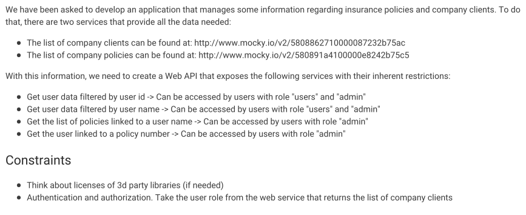

<h1 align="center">Node project using policies data 👋</h1>
<p>
  
  <a href="#" target="_blank">
    
  </a>
</p>

### Description



### API usage

Pass url parameter `credentialName` to identify the user asking the information and `name`, `id`, and `policyId` to request the information wanted.

Requests examples from browser or Postman:
- Get user data filtered by user id and/or name:<br />
http://localhost:3000/api/user?credentialName=Britney&name=Manning<br />
http://localhost:3000/api/user?credentialName=Britney&id=a3b8d425-2b60-4ad7-becc-bedf2ef860bd<br />
- Get policies by user name:<br />
http://localhost:3000/api/policiesByName?credentialName=Britney&name=Manning
- Get user linked to policy id:<br />
http://localhost:3000/api/userByPolicy?credentialName=Britney&policyId=64cceef9-3a01-49ae-a23b-3761b604800b

## Install

```sh
npm i
```

## Usage

```sh
npm start
```

## Run tests

```sh
npm run test
```

## Show your support

Give a ⭐️ if this project helped you!